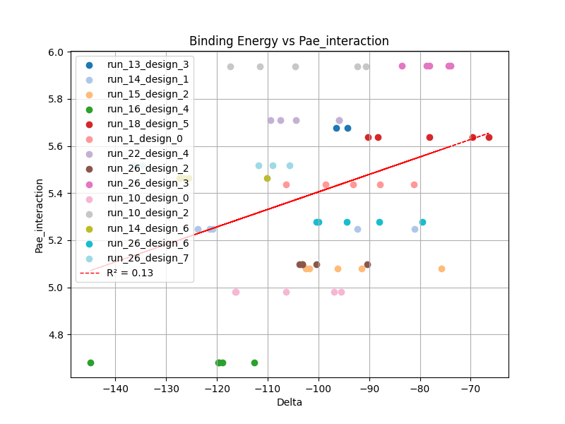
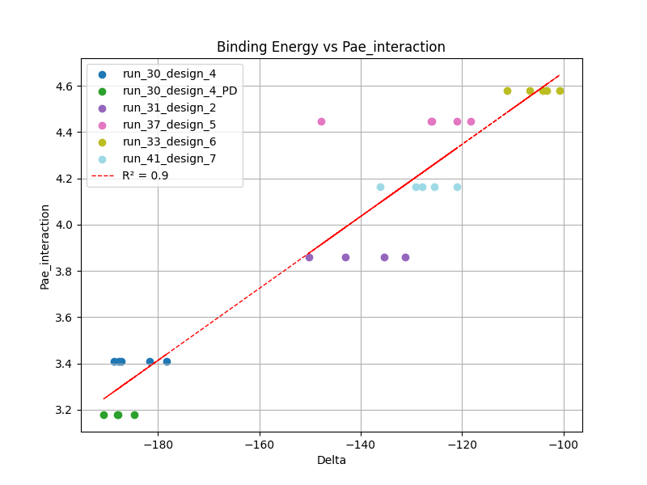
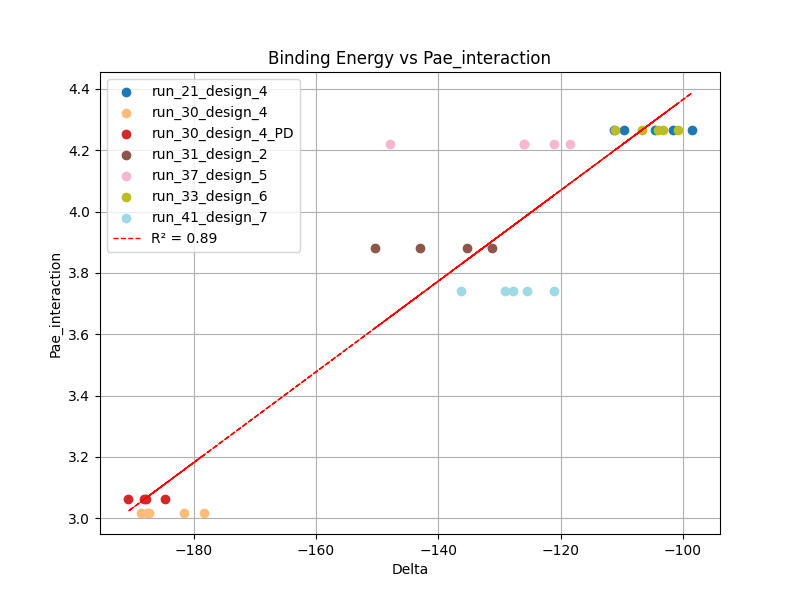

# MICROPEPTIDE GROMACS

This is just a notebook to start playing around with GROMACS, specially to try to compute the PBMM/SA of the binding and so on.
I'll try to do this using the micropeptides Rafa generated because of two reasons:

--> They are quite small so they will be faster than the RAGs or TRF1

--> AF2 predicts that they would do a lot of cool things like getting close and open, and a thing like that in my TFM luciria a lot

I'm running this trials in the folder /emdata/cchacon/GROMACS_micropeptide

We start with the run_41_PD design because of it is shape:


And we are going to check it both in presence of the micropeptide (open) and in absence of the micropeptide (also open, but I hope it will close) in two different folders: run_41 and run_41_chain_A respectively.

I will try to two different box sizes and shapes in order to increase efficiency for the two folders.

The pipeline for the run_41 was:

```bash 
load_gromacs3

gmx pdb2gmx -f inputs/* -ignh -ter
#I added the ter because when it starts with a Met it gets a little bit silly, so you have to specify the termini (1 0 works for me)

#Box edit and solvatation
gmx editconf -f conf.gro -d 2.0 -bt cubic -o box.gro 
gmx solvate -cp box.gro -cs -o solvate.gro -p topol.top

cp ../../MD_PolG_mutants/PolGa_mut10_E1026A/*mdp . #Copy all the MDP files !!!!

#Adding ions
gmx grompp --f ions.mdp -c solvate.gro  -p topol.top -o ions.tpr
gmx genion -s ions.tpr -neutral -conc 0.15 -o ions.gro -p topol.top

#Energy minimization
gmx grompp -f em.mdp -c ions.gro -p topol.top -o em.tpr
gmx mdrun -v -deffnm em
gmx energy -f em.edr -o potential.xvg
python3 /home/cchacon/Carlos_scripts/GROMACS/gromacs_visual.py --folder plots --file potential.xvg --mode E

#Equilibration NVT
gmx grompp -f nvt.mdp -c em.gro -r em.gro -p topol.top -o nvt.tpr
gmx mdrun -v -deffnm nvt
gmx energy -f nvt.edr -o temperature.xvg
python3 /home/cchacon/Carlos_scripts/GROMACS/gromacs_visual.py --folder plots --file temperature.xvg --mode T

#Equilibration NPT
gmx grompp -f npt.mdp -c nvt.gro -r nvt.gro -p topol.top -o npt.tpr
gmx mdrun -v -deffnm npt
gmx energy -f npt.edr -o pressure.xvg
gmx energy -f npt.edr -o density.xvg
python3 /home/cchacon/Carlos_scripts/GROMACS/gromacs_visual.py --folder plots --file density.xvg --mode D
python3 /home/cchacon/Carlos_scripts/GROMACS/gromacs_visual.py --folder plots --file pressure.xvg --mode P

#Production run
load_gromacs2 #Important, right now the production run and the file generations are done in different versions, so to generate the last file you have to use the older version of GROMACS Change!!
gmx grompp -f run.mdp  -c npt.gro -t npt.cpt -p topol.top -o run20ns.tpr
sbatch gromacs_submit_cluster.sh "run20ns.tpr" "0"

gmx trjconv -s run20ns.tpr -f production_run.part0001.xtc -o noPBC.xtc -pbc mol -center
```

The pipeline for run_41_chain_A was:


```bash 
load_gromacs3

gmx pdb2gmx -f inputs/* -ignh -ter
#I added the ter because when it starts with a Met it gets a little bit silly, so you have to specify the termini (1 0 works for me)

#Box edit and solvatation
gmx editconf -f conf.gro -d 1.5 -bt triclinic -o box.gro 
gmx solvate -cp box.gro -cs -o solvate.gro -p topol.top

cp ../../MD_PolG_mutants/PolGa_mut10_E1026A/*mdp . #Copy all the MDP files !!!!

#Adding ions
gmx grompp --f ions.mdp -c solvate.gro  -p topol.top -o ions.tpr
gmx genion -s ions.tpr -neutral -conc 0.15 -o ions.gro -p topol.top

#Energy minimization
gmx grompp -f em.mdp -c ions.gro -p topol.top -o em.tpr
gmx mdrun -v -deffnm em
gmx energy -f em.edr -o potential.xvg
python3 /home/cchacon/Carlos_scripts/GROMACS/gromacs_visual.py --folder plots --file potential.xvg --mode E

#Equilibration NVT
gmx grompp -f nvt.mdp -c em.gro -r em.gro -p topol.top -o nvt.tpr
gmx mdrun -v -deffnm nvt
gmx energy -f nvt.edr -o temperature.xvg
python3 /home/cchacon/Carlos_scripts/GROMACS/gromacs_visual.py --folder plots --file temperature.xvg --mode T

#Equilibration NPT
gmx grompp -f npt.mdp -c nvt.gro -r nvt.gro -p topol.top -o npt.tpr
gmx mdrun -v -deffnm npt
gmx energy -f npt.edr -o pressure.xvg
gmx energy -f npt.edr -o density.xvg
python3 /home/cchacon/Carlos_scripts/GROMACS/gromacs_visual.py --folder plots --file density.xvg --mode D
python3 /home/cchacon/Carlos_scripts/GROMACS/gromacs_visual.py --folder plots --file pressure.xvg --mode P

#Production run
load_gromacs2 #Important, right now the production run and the file generations are done in different versions, so to generate the last file you have to use the older version of GROMACS Change!!
gmx grompp -f run.mdp  -c npt.gro -t npt.cpt -p topol.top -o run20ns.tpr
sbatch gromacs_submit_cluster.sh "run20ns.tpr" "0"

gmx trjconv -s run20ns.tpr -f production_run.part0001.xtc -o noPBC.xtc -pbc mol -center
```


I did not achieve to replicate the binding when I put the binder next to the target, since i have to put them far apart because if not GROMACS becomes a little bit crazy

I started employing the gmx_MMPBSA. This softwarre, pretty well explained in their webpage, only works for comparison, not for absolute values in the protein-protein interaction. The next goal is to compare if the GROMACS output yields a good result.

When I employ the gmx_MMPBSA I get similar results between PB (which is consider to be more exact) and the GB (which is much more faster but the parameter selection is more delicated). The only things I modify from the gmx_MMPBSA is the salt concentration and the temperature, but further investigations should be done.

After reading this [webpage](https://pubs.acs.org/doi/full/10.1021/acs.chemrev.9b00055#) I changed a few thing of the gmx_MMPBSA protocol: 

--> I started using mpirun with 10 cpus because it speeds up a lot the calculations
--> Instead of a long 20ns simulations, I promediate the result over 5 2ns runs 

Doing that, I obtain the following result when plotting pae_interaction_global vs BindingEnergy:



If we remove the outlier run_21:



And using pae_interaction_local:



Clearly pae_local seems to perform better, but further studies should be done. The sample is pretty small and there are some strange things happening with the pae_interaction_global data (no termina de dar los mismos resultados)
