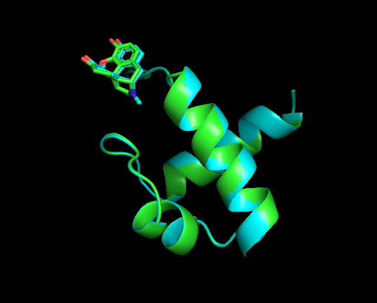

# RFAA

Small notebook to write down what I am doing with RFAA. First of all, it works, and the script /home/cchacon/Carlos_scripts/RFAA/RFAA_cycle* is automatized to work with ZINC database

My suggestion on the pipeline will be:

--> First download all the ZINC compounds in sdf format
--> Put all the files in a folder called compound and create a folder per compound in a parent directory through:

```bash 
cd compound

for compound in ZINC* ; do mkdir -p $compound ; done 
```
--> Create a folder called protein or fasta in which you put your fasta sequences
--> Run /home/cchacon/Carlos_scripts/RFAA/RFAAformat.py to create the input.yaml for each folder. It admits a maximum of two fastas
    RFAAformat.py takes as input a fasta flag, with the direction of the fastas, a folder in which the yaml is going to be saved and a comp flag with the direction of the fasta
```bash 
for folder in ZINC* ; do comp_name="$folder.sdf" ; python3 /home/cchacon/Carlos_scripts/RFAA/RFAAformat.py --fasta fastas/ragA.fasta fastas/ragC.fasta --folder $folder --comp compounds/$comp_name ; done
```
--> Run the /home/cchacon/Carlos_scripts/RFAA/RFAA_cycle* . Probably in the future should be adequate to add a flag to select how many jobs to send to the cluster (right now 5 to the cryoem and 10 to the cluster_cnio)
```bash 
bash ../scripts/RFAA_cycle_cryo.sh
```
To analyze the results, run close_residues_aa.py in pymol and Scoring_csv.py

```bash 
#From the parent directory
for folder in ZINC*; do pymol -c /home/cchacon/Carlos_scripts/RFAA/close_residues_aa.py --protein $folder/$folder.pdb --length 880 ; done
#Right now it needs the length of the protein without the compound
for folder in ZINC* ; do echo $folder ; python3 /home/cchacon/Carlos_scripts/RFAA/Scoring_csv.py --folder $folder ; done
```
This returns two csvs, one called close_residues.csv which is not relevant, and a csv with the scoring (plddt, pae_interaction and cutre)
In the paper they mentioned as relevant those compounds with a pae smaller than 10

## FASTER

Rafa noted that RFAA spends most of the time performing the sequence alignement. One way to avoid this is performing one prediction and then copying hte folder which should be called as the compound, in case you are using RFAAformat. 

Only check with one compound, but it is 3.98 times faster this way in the case of myb. However, there are slight modifications in the prediction (that can be due to the prediction process and non related to the fact that we are copying the alignment)



There is a RMSD between the protein chains of 0.799 $\AA$ and between the ligand of 0.465 $\AA$

I also do the same thing with the Rags complex, and is like 10 times faster
